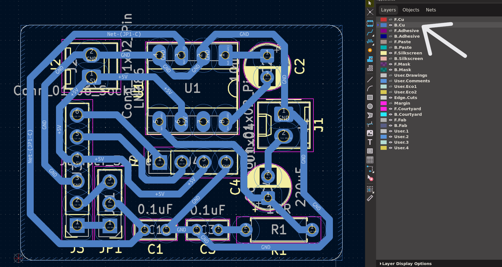
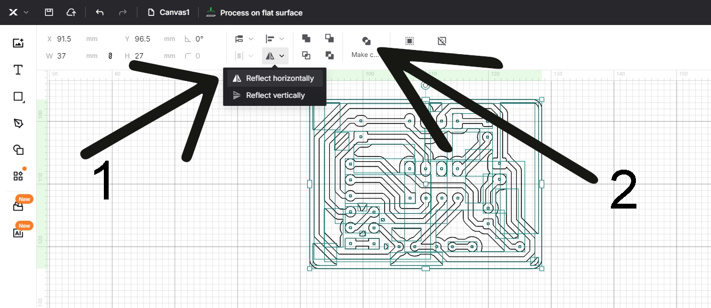
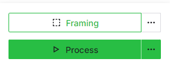

# DTU Ballerup PCB prototyping
Guide for producing PCB's from KiCad with DTU Ballerup equipment. 

 

## What will you need?
- [KiCad 9.0+](https://www.kicad.org/download/)
- A **single-sided**[^1] copper PCB FR4 board.
- Have participated in the safety course held by the professor or TA's.

 

## Contents
- [What to keep in mind](#what-to-keep-in-mind)
- [Making PCBs with the Fiber laser](#making-pcbs-with-the-fiber-laser)
- [Making PCBs with the Roland CNC router](#making-pcbs-with-the-roland-cnc-router)

 

## What to keep in mind
PCB's made in the course [62733](https://kurser.dtu.dk/course/62733) should preferably be made as **one-sided** PCB[^1]. Therefore, make sure to do all of your traces on the back side layer (B.Cu) in the KiCad PCB Editor:

> [!TIP]
> A quick way to check if you have selected the correct layer is, if the traces drawn becomes blue.
>
> If your traces are red, then you have selected the top layer (F.Cu).

It can also be a good idea to increase the size of traces for easier result consistency[^2].
> [!IMPORTANT]
> This step should be done **before** designing your PCB.
>
> It is **not possible to do afterwards.**

**To do so, do as shown in the *GIF*:**
1. Go into *Board Setup*, by clicking the small green circuit icon next to the save button.
2. Choose the *Net Classes* option under *Design Rules*:
3. Change *Clearance* to **0,8 mm** and *Track Width* to a minimum of **0,8 mm**, if possible then 1,0 mm and larger is prefered for working with most through-hole component PCB's made on the Fiber laser and CNC router.

  
<b>Step by step with pictures

  
   1. Go into *Board Setup*, by clicking the small green circuit icon next to the save button.

   

   2. Choose the *Net Classes* option under *Design Rules*:

   

   3. And change both *Clearance* and *Track Width* to 0,8 mm **minimum**. 1,0 mm and above, if possible, is prefered for working with most through-hole component PCB's made on the Fiber laser and CNC router.
  

 

## Making PCBs with the Fiber laser
- [Selecting the right components](#selecting-the-right-components)
- [Correcting your design for the Laser](#correcting-your-design-for-the-laser)
- [Exporting from KiCad](#exporting-from-kicad)
- [Preparing your PCB](#preparing-your-pcb)
- [Using the Fiber laser](#using-the-fiber-laser)

 

### Selecting the right components
Make sure that you have selected the proper footprints for your components. If you use components from the Component-shop on Ballerup Campus, use the footprints at the bottom of this guide [^3].

 

### Correcting your design for the Laser
Before moving to making your PCB on the Fiber laser, you'll need to add a *Filled zone* with some certain settings. We do this as a hack to isolate the traces, and save time and material when we use the Fiber laser. If we were to simply export a PCB with only the traces and an outline, the laser would remove everything but the traces, which would take longer, wear out the laser faster, and be more messy than simply removing a smaller area around the traces.

To create a proper *Filled zone* for the purpose of using the Fiber laser, do as shown in the GIF:

  
<b>Step by step with pictures

  
   1. Select the back cobber layer **B.Cu**.

   2. Select *Draw Filled Zones* from the toolbar on the right.

   3. Select your first corner of the PCB.

   4. Be sure that the *B.Cu* layer is selected, and that *\<no net\>* is selected.

   5. Change the following:
      - *Pad connections* to **None**.
      - *Clearance* to **0,75** mm.
      - *Minimum width* to **0,25** mm.
      - *Fill type* to **Solid fill**.

   6. Finish selecting the rest of your corners, until the board gains a hatched outline.

   7. Go into `Edit` and click `Fill All Zones`.
  

### Exporting from KiCad:
When choosing to make your PCB with the Fiber laser, you need to do the following steps in KiCad:
#### 1. Open the *Plot* window by going into:
`File - Fabrication Outputs - Gerbers (.gbr)`

#### 2. Change *Plot format* to **DXF**, and select where you wish to save your exported file:

Be sure to choose a folder you can find later, since you will need this file for the actual making of the PCB.

#### 3. In the *Plot* window, make sure that the following settings are selected:

Where the most important settings are as follows:
   - *Include Layers*: **B.Cu**.
   - *Plot on All Layers*: **Edge.Cuts**
   - *Drill marks*: **Small**
   - *Plot graphic items using their contours*: **Unselected**
   - *Plot drawing sheet*: **Unselected**
   - *Export units*: **Millimeters**

When the settings match the list above, export your DXF file by clicking *Plot*.

---

 

### Preparing your PCB

The most important step before going out and making or buying a PCB, is doing the your basic checks you learned in the course!
- Have you used the correct footprints?
- Have you designed your PCB on the correct size, and not flipped any components?
- Have you tried running the *Design Rule Checker* (DRC)?
- Have you added your own PCB board cutout in the `Edge.Cuts` layer?
If any of these steps have been skipped or done incorrectly, then making the PCB is a waste because its likely not working once you have it in your hand.

Before going out to find and cut a bare PCB board, take some measuments of your design in KiCad so you know how big to cut your PCB on the shear. Be sure to not going too tight with your measurments. Add around 2mm to your total width and length, so you don't risk your final board coming out too small.

When finding a bare PCB board:
- **Please don't use the boards with the blue film on**. They are not meant for the Fiber laser.
- Do not take a double-sided PCB board.

Ask for a proper bare PCB board if you are not able to find one.

After cutting your board to the correct size (plus your added 2~mm padding), take some 400 grit sandpaper and brush the surface a bit. **Don't overdo it!** We just need to remove the protective/oxide layer before moving onto the Fiber laser.

---

 

### Using the Fiber laser
> [!CAUTION]
> **Have you completed the safety course???**
>
> If not, then you are not allowed to use the machine! Please contact the course Professor or TA's, alternativly someone from BuildDesign Lab.

> [!IMPORTANT]
> Please have your **DXF file** and **pre-cut PCB** ready ***before booking the laser***
>
> Otherwise you will end up blocking the machine for others that may be prepared to use the machine.

1. Open the xTool software by clicking on the *xTool Creative Space* icon on the desktop, and create a new project, by clicking on the *X* icon in the top right corner of the window, or by opening a new tab.

2. In the top left corner, click on the **X** icon, then `File` and `Import image`.

3. Find your generated *dxf* file, and open it.

4. When the files is imported, **make sure to *flip* your design and make it *compound***.

5. When you select your design, you should see the right panel change. Select **Engrave**, and make sure that *Output* is green.

6. Confirm that your design looks something like this. **Note**, the black parts of the design will be **removed** by the laser.

> [!NOTE]
> The default import does not make the holes for the through-hole components.
> To fix this, and have the holes engraved as well, click on the icon next to the *Make compound* called **Edit compound**.
> Then select a hole and click delete on your keyboard, it should then become black like the rest of the engraving areas.
> Do this for every hole in your PCB design, untill they are all black.

7. Make sure that the sacrificial build-plate on the Laserbed, and lay your [**prepared board**](#preparing-your-pcb) onto the sacrificial build-plate. Try and get your design to be as much in the center of the machine as possible.

8. Now click on the *Framing* button in the lower right corner of the xTool window. A blue outline of your design will appear on the machinne. Use this box to align your [**prepared board**](#preparing-your-pcb) to where the machine will cut. 

Be sure that the framing box fit and does not spill over the edges.. If the *laser-frame* spills over the edges, then **do not cut!** Your PCB will likely come out wrong, and **you may damage the machine!**.

Also, if your board is cut too close to the final PCB size, it becomes quite difficult to get the alignment right. If its too tight, start over and cut a larger piece. It is much easier to cut your PCB to size **after** it has been engraved, rather than before.

9. If a picture of the machine bed is not shown within the software click on the camera icon next to the automatic height button.
**Make sure** that the design does not flow over the edges! You should strive to place your design as much in the middle of your board as possible.

10. Stop the framing, and then click the *Auto height ajustment* button, and wait for the machine to complete.

11. Click on the presets just beneith the *Engrave* Tab, and select the preset called *PCB*. Make sure that the cutting parameters match those on the pictures, or the updated settings given to you by your instructers, professor or TA's.

**This is your last chance to check if everything seems correct**.

> [!IMPORTANT]
> Please check the following:
> - Is my design mirrored on the Laser software? If not, mirror the design!
> - Is the Traces of my design white, and the area round it black? Remember that the black areas are removed, so if your traces are black, then your PCB is useless.
> - Have I cut the PCB board large enough and have I brushed the surface? If not, then go back and do so.
> - Is my cutting parameters all correct? If not, then go back and make sure the settings match the recommended settings.
> 

12. When everything is ready, click the *Process* button, and follow the steps for starting the machine.

When the machine is working, remember to not stare at the burn light on the PCB!

---

## Making PCBs with the Roland CNC router
Work in progress (monoFab SRM-20)

---

[^1]: Currently we are limited to one-sided PCB's until further testing and workflows are prepared. The students are free to try their hand ad two-sided PCB's, but should then consult with the people responsible for the machines, and it will be at their own risk and time.

[^2]: This step is only necessary for PCB-milling and Fiber-etching.

[^3]: List of footprints for the components in the DTU-components-shop:

| Component       | DTU Component shop name | KiCAD footprint                                                      |
|-----------------|-------------------------|----------------------------------------------------------------------|
| Resistors       | Resistor section        | Resistor_THT:R_Axial_DIN0204_L3.6mm_D1.6mm_P7.62mm_Horizontal        |
| PinSockets      | Connector section       | Connector_PinSocket_2.54mm:PinSocket_1x02_P2.54mm_Vertical           |
| PinHeaders      | Connector section       | Connector_PinHeader_2.54mm:PinHeader_1x02_P2.54mm_Vertical           |
| ICs and sockets | Connector section       | Package_DIP:DIP-***\<change this to the number of pins\>***_W7.62mm_LongPads |
| Diodes          |                         | Diode_THT:D_DO-35_SOD27_P7.62mm_Horizontal                           |
| Large LEDs      | LED section             | LED_THT:LED_D5.0mm                                                   |
| Small LEDs      | LED section             | LED_THT:LED_D3.0mm                                                   |
| Effect-resistor |                         | Resistor_THT:R_Axial_DIN0617_L17.0mm_D6.0mm_P20.32mm_Horizontal      |
| Screw terminal (3 connecters)  |                         | TerminalBlock:TerminalBlock_bornier-3_P5.08mm |